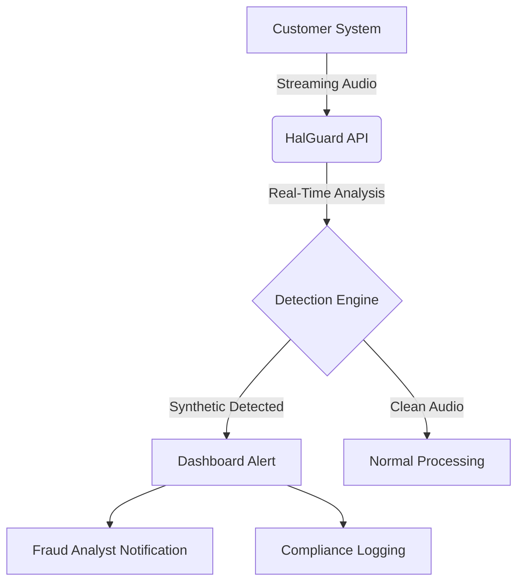

# HalGuard Security Dashboard  
**Real-Time Synthetic Media Fraud Monitoring, Reporting, and Insights**

---

## 🚀 Overview

The **HalGuard Security Dashboard** is the centralized dashboard for detecting, monitoring, and responding to **synthetic media threats** - starting with **voice clone detection (HalGuard VoiceShield)** and expanding to **deepfake video detection (DeepShield)** and **AI-generated phishing text detection (TextShield)** in future releases.

---

## 📌 Initial Scope (Phase 1)

🔊 **HalGuard VoiceShield (Live)**  
Focus: **Real-time voice clone detection** in:
- Call centers
- Onboarding flows 
- Financial transactions

🧭 Supports:
- **Streaming detection (WebRTC/SIP integration)**  
- **Batch analysis for recorded calls (S3 or uploaded files)**  
- **Fraud risk scoring with explainability**  
- **Detection event logs and compliance-ready exports**

---

## 🛠️ Technical Deep Dive

### 🎙️ 1. Detection via HalGuard API

**Sample Request**:
```http
POST /analyze/stream HTTP/1.1
Host: api.halguard.io
Authorization: Bearer YOUR_API_KEY
X-HalGuard-Secret: YOUR_CLIENT_SECRET
Content-Type: application/json

{
  "audio": {
    "format": "wav",
    "sample_rate": 16000,
    "data": "base64_encoded_audio_chunk"
  },
  "metadata": {
    "caller_id": "+1234567890",
    "ip": "192.168.1.1",
    "device_id": "TwilioFlex/1.0"
  }
}
```

**Sample Response**:
```json
{
  "risk_score": 0.92,
  "is_synthetic": true,
  "reasons": [
    {
      "feature": "pitch",
      "anomaly": "low_variability",
      "confidence": 0.91
    },
    {
      "feature": "spectrogram",
      "anomaly": "GAN_artifacts_detected",
      "confidence": 0.87
    }
  ],
  "recommended_action": "block"
}
```

### 📡 2. Dashboard Integration Flow



---

## 📊 Key Features

| Feature                        | Description                                                                 |
|--------------------------------|-----------------------------------------------------------------------------|
| 🟢 Live Detection Feed         | Real-time alerts with audio waveform preview                               |
| 🖼️ Explainable Insights       | Confidence scores + AI-detected anomalies                                  |
| 📈 Fraud Heatmaps              | Geolocation tracking of synthetic media sources                            |
| 📋 Compliance Reports          | One-click PDF/CSV exports for auditors                                      |

---

## ⚙️ Deployment Options

| Model                | Use Case                                  | Requirements              |
|----------------------|-------------------------------------------|---------------------------|
| **SaaS**             | Fast deployment                          | Internet connection       |
| **On-Prem**          | HIPAA/GDPR compliance                    | Kubernetes cluster        |
| **Edge** (Q4 2024)   | Low-latency field ops                    | NVIDIA T4 GPU minimum     |

---

## 🛡️ Why Choose Dashboard + API?

```diff
+ Visual Fraud Analytics       - Raw JSON Only
+ Team Collaboration           - Developer-Centric
+ Compliance Automation        - Manual Processes
+ Role-Based Access            - All-or-Nothing Access
```

---

## 📢 Get Started

**1. Install SDK**:
```bash
npm install halguard-sdk --save
```

**2. Basic Detection**:
```python
from halguard.voiceshield import VoiceShieldDetector

detector = VoiceShieldDetector(
    api_key="hg_live_...",
    mode="realtime" # or 'batch'
)

result = detector.analyze_stream(
    audio_file="recording.wav",
    metadata={"caller_id": "+1234567890"}
)

print(f"Risk Score: {result.risk_score}")
print(f"Recommendation: {result.recommended_action}")
```

**Contact**: [support@halguard.io](mailto:support@halguard.io)  
**Documentation**: [https://docs.halguard.io](https://docs.halguard.io)  
**Status Page**: [https://status.halguard.io](https://status.halguard.io)